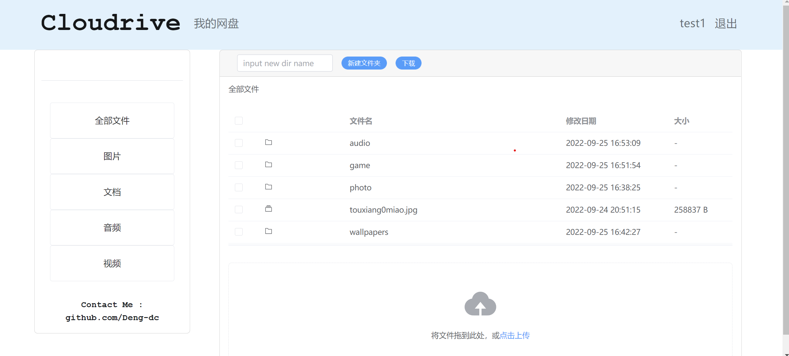

# cloud-drive

#### Project setup
```
npm install
```

#### Compiles and hot-reloads for development
```
npm run serve
```

#### Compiles and minifies for production
```
npm run build
```

#### Lints and fixes files
```
npm run lint
```

#### Discription
```
Cloudrive是一个网页版的云盘项目，具有账号系统，用于文件的上传下载以及文件管理等功能
！！！此项目适用于vue新手的练习项目，仅供学习，禁止用于商业使用！！！
```

#### Preview
```
目前版本已实现: (1)登录和注册功能; (2)文件上传; (3)面包屑导航; (4)新建文件夹
```


#### About
```
项目服务器代码 : https://github.com/Deng-dc/CloudDrive
contact me : dengc99@163.com
```